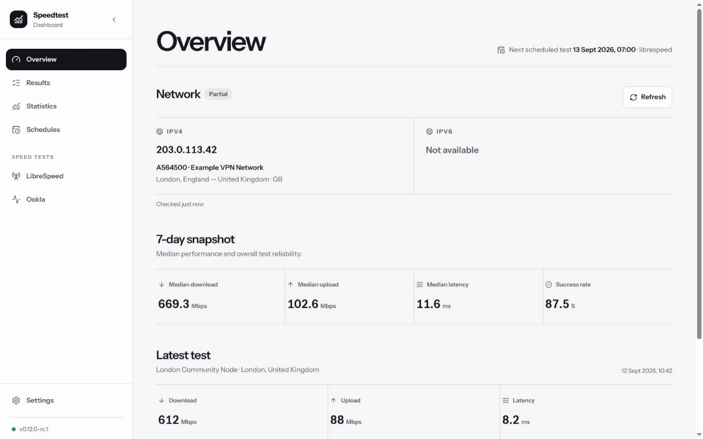
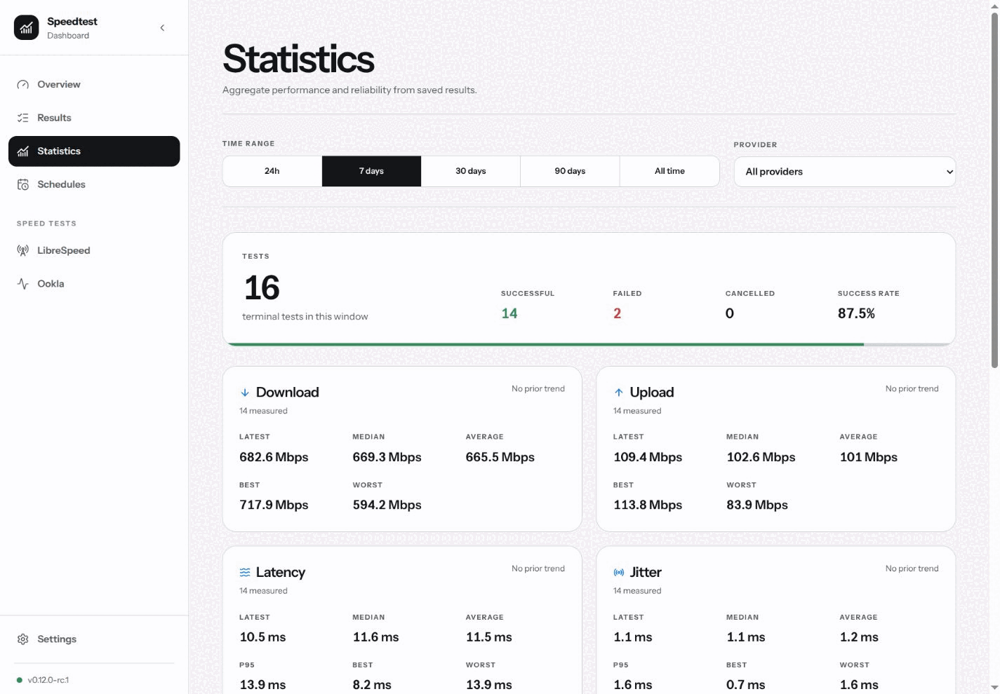
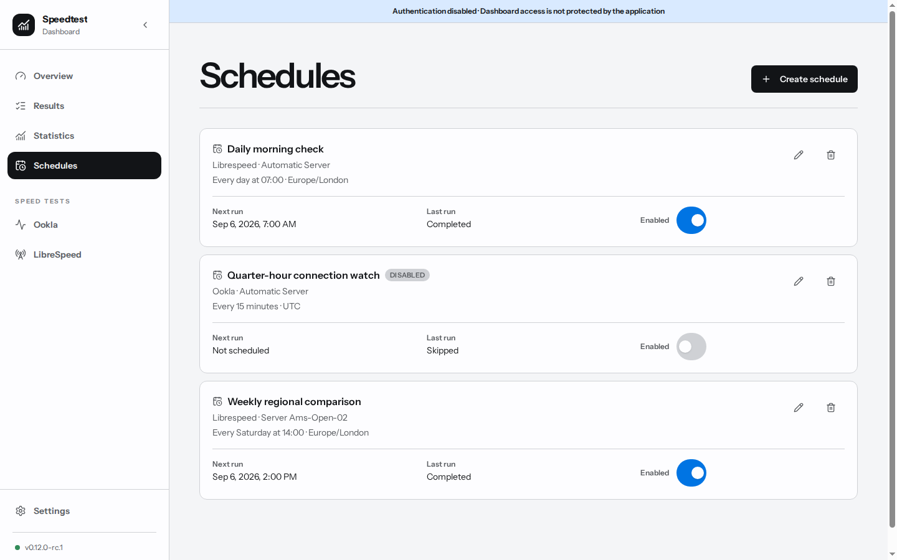
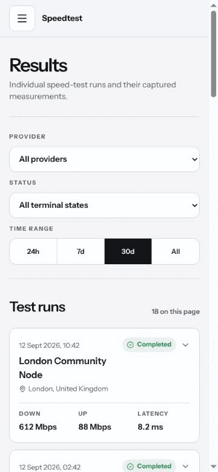

# Speedtest Dashboard

A self-hosted dashboard that runs speed tests, keeps the results, and shows which public IP the machine is using.

Run it alongside [Gluetun](https://github.com/qdm12/gluetun), another WireGuard/OpenVPN setup, or on a regular server connection.

## Why this exists

My ISP wanted three speed tests a day - morning, afternoon, and evening - for five days as evidence that I was not getting the advertised speeds.

I also wanted to compare VPN providers and regions, with the exit IP saved alongside each result. Those two things were the inspiration for the app.

The tests run wherever the dashboard is installed. Put it behind Gluetun and it tests the VPN connection. Run it normally and it tests the server's usual internet connection. The displayed IP is a handy sanity check, but it cannot guarantee that your VPN or kill switch is configured correctly.



## What you get

- LibreSpeed and FAST.com ready to go; LibreSpeed also supports pinned server selection
- saved download, upload, latency, jitter, packet-loss, server, and public-IP details
- charts covering the last 24 hours, 7, 30, or 90 days, or everything recorded
- schedules for regular tests, whether that means every few minutes or once a week
- optional Ookla support for local builds
- a simple single-user login if you do not want the dashboard left open
- an API for Home Assistant, scripts, dashboards, and other things you want to wire up
- Docker images for `amd64` and `arm64`, plus native unprivileged Proxmox LXC templates

## Get it running

Pick whichever flavour fits your lab. The examples use `latest` to keep the first run simple; pin a release tag once you are happy with it.

Replace `<owner>` with the GitHub repository owner in the image and release URLs.

### Docker command

```bash
docker volume create speedtest-data

docker run -d \
  --name speedtest-dashboard \
  --restart unless-stopped \
  -p 8008:8008 \
  -e DASHBOARD_PORT=8008 \
  -v speedtest-data:/data \
  ghcr.io/<owner>/speedtest-dashboard:latest
```

Open `http://<docker-host>:8008`. Port `8008` is only an example; set `DASHBOARD_PORT` and the port mapping to any free port.

### Docker Compose

```yaml
services:
  speedtest-dashboard:
    image: ghcr.io/<owner>/speedtest-dashboard:latest
    container_name: speedtest-dashboard
    restart: unless-stopped
    ports:
      - "8008:8008"
    environment:
      DASHBOARD_PORT: "8008"
    volumes:
      - speedtest-data:/data

volumes:
  speedtest-data:
```

Save that as `compose.yml`, then:

```bash
docker compose up -d
docker compose logs -f speedtest-dashboard
```

The repo also ships a ready-made [production Compose file](packaging/containers/compose.yml) plus a [full Docker and Podman guide](packaging/containers/README.md).

### Put it behind Gluetun

If both services live in the same Compose project, let the dashboard borrow Gluetun's network stack:

```yaml
services:
  gluetun:
    image: qmcgaw/gluetun:latest
    container_name: gluetun
    # Keep your existing Gluetun capabilities, device and VPN settings here.
    ports:
      - "8008:8008" # Speedtest Dashboard UI

  speedtest-dashboard:
    image: ghcr.io/<owner>/speedtest-dashboard:latest
    container_name: speedtest-dashboard
    network_mode: "service:gluetun"
    restart: unless-stopped
    environment:
      DASHBOARD_PORT: "8008"
    volumes:
      - speedtest-data:/data

volumes:
  speedtest-data:
```

Notice that port `8008` is published by the `gluetun` service. Containers sharing Gluetun's network also share its ports, so choose any unused port and use the same number for `DASHBOARD_PORT` and Gluetun's port mapping.

Already running Gluetun elsewhere? The equivalent Docker flag is `--network container:gluetun`, and the port still needs to be published by the Gluetun container. The [container guide](packaging/containers/README.md#routing-tests-through-gluetun) has complete same-stack, separate-project, and port-clash examples.

### Proxmox LXC

Download the template matching your host, verify it, and create an unprivileged container. On the Proxmox host that looks roughly like this:

```bash
wget <release-url>/speedtest-dashboard_0.12.0-rc.1_amd64.tar.zst \
  -O /var/lib/vz/template/cache/speedtest-dashboard_0.12.0-rc.1_amd64.tar.zst

pct create 120 \
  local:vztmpl/speedtest-dashboard_0.12.0-rc.1_amd64.tar.zst \
  --hostname speedtest-dashboard \
  --unprivileged 1 \
  --cores 2 \
  --memory 1024 \
  --swap 512 \
  --net0 name=eth0,bridge=vmbr0,ip=dhcp \
  --start 1
```

Browse to `http://<container-ip>:8080`. The template runs the app directly with systemd and keeps its data under `/var/lib/speedtest-dashboard`. Upload locations, checksums, firewall notes, ARM templates, and build instructions live in the [Proxmox LXC guide](packaging/proxmox/README.md).

## First few minutes

Fresh installs open without a login so you can make sure networking works. Run a test, check that the displayed exit IP belongs to the route you expected, then add a schedule or two.

If the dashboard is reachable beyond a trusted LAN, put it behind HTTPS and enable login protection in Settings. For a deliberately isolated HTTP-only lab, set `Authentication__AllowInsecureHttp=true` before configuring a login.

The container itself is disposable; `/data` is not. That directory holds SQLite, schedules, login state, the protected API credential, and session keys. Keep it mounted, do not point two dashboard containers at the same database, and stop the container before making a filesystem-level copy.

## A few more screenshots

The screenshots use a temporary database and documentation-only IP addresses. No real VPN account or endpoint is shown.

### Statistics



### Schedules



### Mobile results



## Providers

### LibreSpeed

Published images and LXC templates include LibreSpeed CLI `1.0.13`, built from commit `2f2408764d88e9601aa64a03b340f8e3151003e4`. Tests run with `--json --no-icmp --secure`; result sharing and telemetry are not enabled. The public HTTPS server catalogue is cached for five minutes.

The source archive is checksum-verified and its LGPL-3.0 licence is included. See [THIRD_PARTY_NOTICES.md](THIRD_PARTY_NOTICES.md).

### FAST.com

Published images and LXC templates include the upstream fast-cli `0.3.5` static binary for amd64 and arm64. The experimental integration uses HTTPS, FAST.com-managed targets, upload testing, and the upstream JSON output. It reports download, upload, and HTTP HEAD latency; server selection, jitter, packet loss, and result sharing are not available.

The release archive is checksum-verified and its MIT licence is included. This first integration intentionally consumes upstream output as-is so its behavior can be validated before maintaining a fork or patches.

### Ookla

The integration is built into the app, but the proprietary Ookla CLI is not included in public images or templates. Local builds can opt in to the pinned, checksum-verified package, then explicitly accept the licence and GDPR terms at runtime.

See [Enable Ookla](docs/ookla.md) for the Docker, Podman, and native Proxmox steps.

## Scheduling and history

Schedules can run once, every 1–10080 minutes, daily, or weekly. Daily and weekly schedules use their saved IANA time zone, including daylight-saving changes.

Every manual, scheduled, or API test goes through the same bounded queue. A due run is recorded as skipped when that queue is full, the previous run is still active, or its chosen provider is no longer available. Missed runs are recorded once after downtime instead of being replayed in a burst.

Results are kept until you delete them. The Results page stores individual runs; Statistics handles summaries, trends, charts, and provider comparisons.

## Home Assistant and API

The API is there for anyone who wants to tinker. You could add a Home Assistant button that runs a test, start one from a voice command, pull the latest result into a sensor, or feed the history into your own dashboard.

Generate an API key in Settings and send it as `Authorization: Bearer <api-key>`. Reads are limited to 120 requests per minute per source IP and writes to 10; the test queue has its own limit.

| Method and route | What it does |
| --- | --- |
| `GET /api/health` | Anonymous health and version check |
| `GET /api/v1/network` | Read the backend's IPv4 and IPv6 identity |
| `GET /api/v1/providers` | List provider health and capabilities |
| `GET /api/v1/providers/{id}` | Read one provider |
| `GET /api/v1/providers/{id}/servers` | Search a provider's servers |
| `POST /api/v1/tests` | Queue a speed test |
| `GET /api/v1/tests/{id}` | Poll a test |
| `GET /api/v1/tests/{id}/events` | Stream test status events |
| `POST /api/v1/tests/{id}/cancel` | Cancel a queued or running test |
| `GET /api/v1/history` | List saved results |
| `GET /api/v1/history/{id}` | Read one saved result |
| `GET /api/v1/statistics` | Read aggregate statistics |
| `GET /api/v1/schedules` | List schedules |
| `GET /api/v1/schedules/{id}` | Read one schedule |

Queue a LibreSpeed test with:

```bash
curl -X POST http://<server>:8008/api/v1/tests \
  -H "Authorization: Bearer <api-key>" \
  -H "Content-Type: application/json" \
  -d '{"providerId":"librespeed","serverId":null}'
```

An optional `Idempotency-Key` header is retained for 24 hours. The API intentionally does not expose result deletion, schedule changes, or login administration.

## Configuration

Environment variables use double underscores for nested settings. These are the ones most people are likely to touch:

| Variable | Default | Why change it |
| --- | --- | --- |
| `Authentication__AllowInsecureHttp` | `false` | Allow login cookies on a trusted HTTP-only LAN |
| `DASHBOARD_PORT` | `8080` | Avoid a clash with another app, especially behind Gluetun |
| `ReverseProxy__TrustForwardedHeaders` | `false` | Enable only behind a trusted reverse proxy |
| `Scheduler__PollIntervalSeconds` | `30` | Change how often due schedules are checked |
| `SpeedTests__QueueCapacity` | `4` | Change the number of waiting test jobs |
| `Storage__DatabasePath` | `/data/speedtest.db` | Move the SQLite database inside the mounted data path |

The full set of process, provider, caching, and queue options is documented in [Configuration reference](docs/configuration.md).

When `ReverseProxy__TrustForwardedHeaders=true`, the app trusts forwarded headers without ASP.NET Core's known-proxy restriction. Only use that when untrusted clients cannot reach the dashboard port directly and your proxy replaces those headers.

## Backups and updates

Back up before changing versions; database migrations run on startup and downgrades are not supported.

- Docker/Podman: stop the container before copying `/data`, then recreate it with the new image while keeping the same volume.
- Proxmox: use normal PVE backup/snapshot tooling, or stop `speedtest-dashboard` before copying `/var/lib/speedtest-dashboard`.

The [container guide](packaging/containers/README.md#storage-backups-and-updates) has copy/paste update commands. Native LXC templates are currently intended for new containers rather than in-place package upgrades.

## Security notes

HTTP requests can choose only a provider and a provider-owned server ID. They cannot supply executable paths, URLs, shell commands, or arbitrary CLI flags. Provider processes use literal argument lists, timeouts, cancellation, bounded output, and process-tree termination.

Browser login is deliberately small: one local operator, no registration, no roles, and no email recovery. The machine API key is independent from that browser session. See [SECURITY.md](SECURITY.md) for reporting a vulnerability.

## Development

You will need .NET SDK 10, Node.js 22+, and npm.

```bash
mkdir -p .data
Storage__DatabasePath="$PWD/.data/speedtest.db" \
Authentication__DataProtectionPath="$PWD/.data/dataprotection" \
Authentication__AllowInsecureHttp=true \
  dotnet run --project src/SpeedtestDashboard.Api --urls http://localhost:5080
```

In another terminal:

```bash
npm ci --prefix src/SpeedtestDashboard.Web
npm run dev --prefix src/SpeedtestDashboard.Web
```

Vite serves `http://localhost:5173` and proxies `/api` to the backend. The deeper implementation notes are in [CONTRIBUTING.md](CONTRIBUTING.md), [architecture](docs/architecture.md), and [release maintenance](docs/releasing.md).

## Licence

Speedtest Dashboard is [MIT licensed](LICENSE). fast-cli is MIT licensed, LibreSpeed CLI remains LGPL-3.0, and Ookla CLI is proprietary and is not included in public artifacts. Provider and platform names are descriptive; this project is not affiliated with Netflix, FAST.com, Ookla, Speedtest.net, LibreSpeed, Docker, Podman, Gluetun, or Proxmox.
